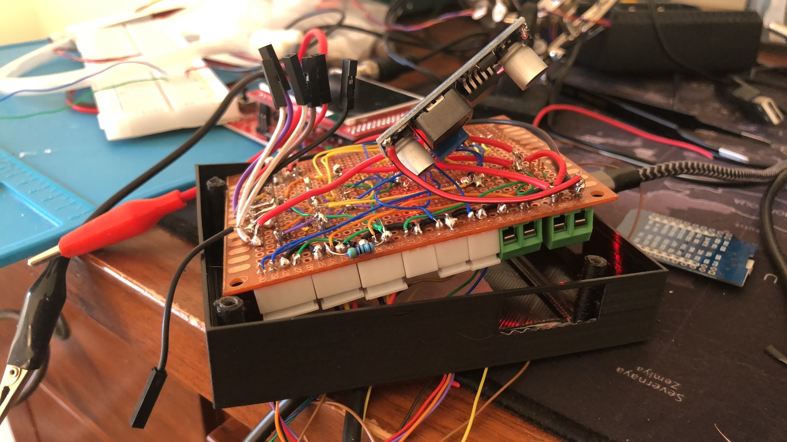
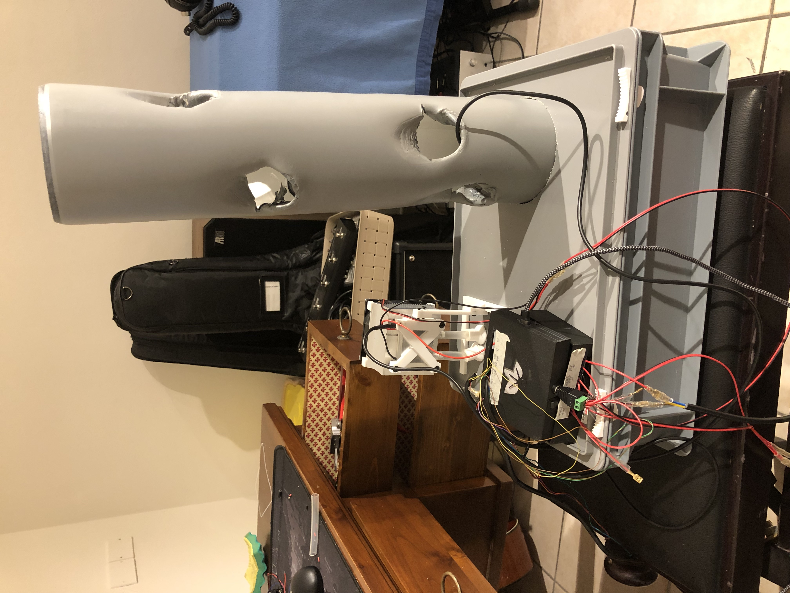
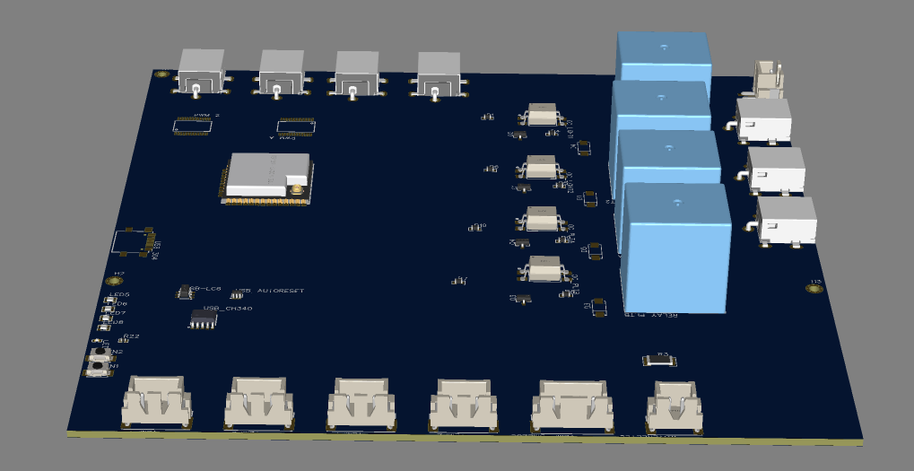

# Boards

Here you can find resources to make your own board starting from existing works.

##Hydroboard1

This is the first project done using GrowNode platform. It is basically a Water Tower with water reservoir temperature control (heating/cooling) done through a Peltier cell, and a water level measurement device done by a capacitance sensor.

Here is the code to startup all the leaves:

	gn_leaf_config_handle_t lights1in = gn_leaf_create(node, "lights1in",
			gn_relay_config, 4096);
	gn_leaf_param_init_double(lights1in, GN_RELAY_PARAM_GPIO, 25);
	gn_leaf_param_init_bool(lights1in, GN_RELAY_PARAM_STATUS, false);

	gn_leaf_config_handle_t lights2in = gn_leaf_create(node, "lights2in",
			gn_relay_config, 4096);
	gn_leaf_param_init_double(lights2in, GN_RELAY_PARAM_GPIO, 5);
	gn_leaf_param_init_bool(lights2in, GN_RELAY_PARAM_STATUS, false);

	gn_leaf_config_handle_t plt_a = gn_leaf_create(node, "plt_a",
			gn_relay_config, 4096);
	gn_leaf_param_init_double(plt_a, GN_RELAY_PARAM_GPIO, 23);
	gn_leaf_param_init_bool(plt_a, GN_RELAY_PARAM_STATUS, false);

	gn_leaf_config_handle_t plt_b = gn_leaf_create(node, "plt_b",
			gn_relay_config, 4096);
	gn_leaf_param_init_double(plt_b, GN_RELAY_PARAM_GPIO, 17);
	gn_leaf_param_init_bool(plt_b, GN_RELAY_PARAM_STATUS, false);

	gn_leaf_config_handle_t waterpumpin = gn_leaf_create(node, "waterpumpin",
			gn_relay_config, 4096);
	gn_leaf_param_init_double(waterpumpin, GN_RELAY_PARAM_GPIO, 19);
	gn_leaf_param_init_bool(waterpumpin, GN_RELAY_PARAM_STATUS, false);

	gn_leaf_config_handle_t waterlevelin = gn_leaf_create(node, "waterlevelin",
			gn_capacitive_water_level_config, 4096);
	gn_leaf_param_init_bool(waterlevelin, GN_CWL_PARAM_ACTIVE, true);
	gn_leaf_param_init_double(waterlevelin, GN_CWL_PARAM_TOUCH_CHANNEL, 2);
	gn_leaf_param_init_double(waterlevelin, GN_CWL_PARAM_UPDATE_TIME_SEC, 10);
	gn_leaf_param_init_double(waterlevelin, GN_CWL_PARAM_MIN_LEVEL, 0);
	gn_leaf_param_init_double(waterlevelin, GN_CWL_PARAM_MAX_LEVEL, 2048);

	gn_leaf_config_handle_t hcc_speed = gn_leaf_create(node, "hcc",
			gn_pump_hs_config, 4096);
	gn_leaf_param_init_bool(hcc_speed, GN_PUMP_HS_PARAM_CHANNEL, 0);
	gn_leaf_param_init_double(hcc_speed, GN_PUMP_HS_PARAM_GPIO_POWER, 18);
	gn_leaf_param_init_double(hcc_speed, GN_PUMP_HS_PARAM_POWER, 0);
	gn_leaf_param_init_double(hcc_speed, GN_PUMP_HS_PARAM_GPIO_TOGGLE, 26);
	gn_leaf_param_init_bool(hcc_speed, GN_PUMP_HS_PARAM_TOGGLE, false);

	gn_leaf_config_handle_t fan_speed = gn_leaf_create(node, "fan",
			gn_pump_hs_config, 4096);
	gn_leaf_param_init_bool(fan_speed, GN_PUMP_HS_PARAM_CHANNEL, 1);
	gn_leaf_param_init_double(fan_speed, GN_PUMP_HS_PARAM_GPIO_POWER, 27);
	gn_leaf_param_init_double(fan_speed, GN_PUMP_HS_PARAM_POWER, 0);
	gn_leaf_param_init_double(fan_speed, GN_PUMP_HS_PARAM_GPIO_TOGGLE, 33);
	gn_leaf_param_init_bool(fan_speed, GN_PUMP_HS_PARAM_TOGGLE, false);

	gn_leaf_config_handle_t bme280 = gn_leaf_create(node, "bme280",
			gn_bme280_config, 8192);
	gn_leaf_param_init_double(bme280, GN_BME280_PARAM_SDA, 21);
	gn_leaf_param_init_double(bme280, GN_BME280_PARAM_SCL, 22);
	gn_leaf_param_init_bool(bme280, GN_BME280_PARAM_ACTIVE, true);
	gn_leaf_param_init_double(bme280, GN_BME280_PARAM_UPDATE_TIME_SEC, 10);

	gn_leaf_config_handle_t ds18b20 = gn_leaf_create(node, "ds18b20",
			gn_ds18b20_config, 4096);
	gn_leaf_param_init_double(ds18b20, GN_DS18B20_PARAM_GPIO, 4);
	gn_leaf_param_init_bool(ds18b20, GN_DS18B20_PARAM_ACTIVE, true);
	gn_leaf_param_init_double(ds18b20, GN_DS18B20_PARAM_UPDATE_TIME_SEC, 5);

	gn_leaf_config_handle_t watering_control = gn_leaf_create(node,
			"watering_control", gn_watering_control_config, 4096);
	gn_leaf_param_init_double(watering_control,
			GN_WAT_CTR_PARAM_WATERING_INTERVAL_SEC, 60 * 1);
	gn_leaf_param_init_double(watering_control,
			GN_WAT_CTR_PARAM_WATERING_TIME_SEC, 20);
	gn_leaf_param_init_double(watering_control,
			GN_WAT_CTR_PARAM_WATERING_TARGET_TEMP, 20);
	gn_leaf_param_init_bool(watering_control, GN_WAT_CTR_PARAM_ACTIVE, true);

The working logic is onboard, represented by the leaf `gn_watering_control`. Basically it keeps the reservoir at a controlled temperature and starts the watering periodically if the water is within admissible range.

MQTT Messaging is then collected by a page in OpenHAB where I can display the status of the components.

I've done a first schematic:

And a first prototype board:

Then i've built a 3D case:

And wired up all together in a demo station:

Now i wanted now to move in a more stable circuit, here is the new schematic:

And you can see a draft of the 3D layout:

