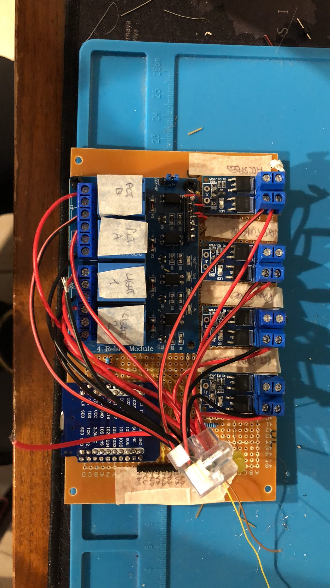
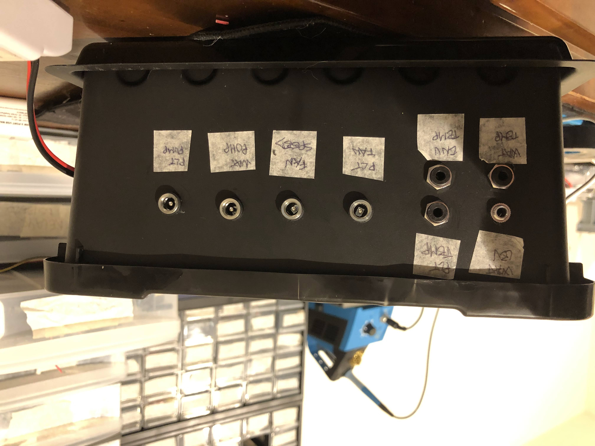
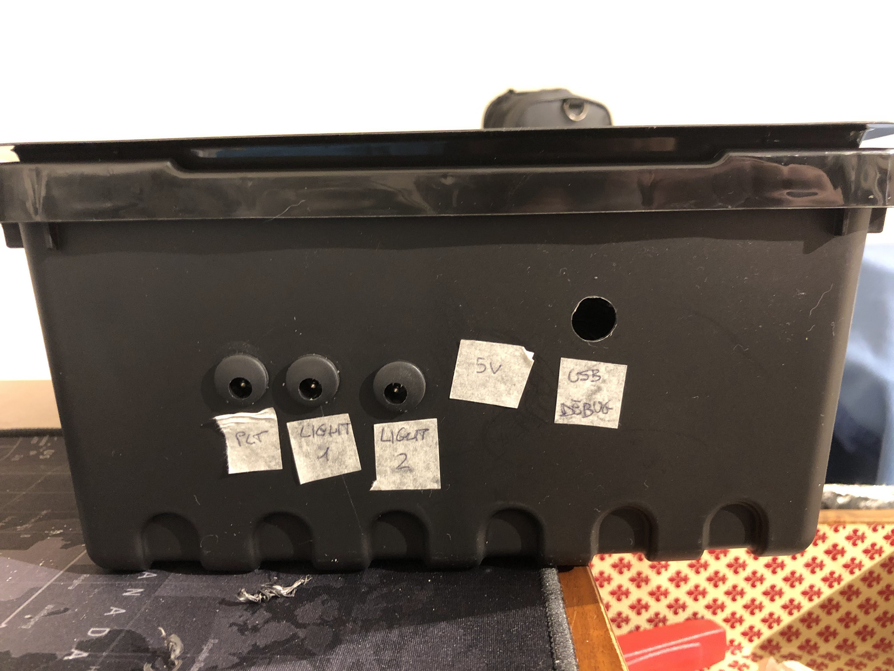

---
hide:
  - navigation
---  

#Hydroboard2

Second attempt to release a Water Tower system. this time I've added some MOSFETs to drive:

##Features

- 4 12VDC PWM output (I personally used them for water pump, peltier pump, peltier fan, environmental fan)
- 4 12VDC Relay output (Lights 1, Lights2, Peltier cell Hot and Cold mode)
- 2 temperature sensors (using DB18B20)
- 1 temperature/humidity/pressure sensor (using BME280)
- 1 capacitive water level sensor

It has an onboard logic to keep the reservoir at desired temperature prior to water it (thus keeping the system on an acceptable temperature range through all the year)

The board is powered with 220V - 12V 10A power adaptor so it can manage quite a lot of power consumption.

#Code

The configuration code is contained in `components\grownode\boards\bydroboard2.c`.

The working logic is onboard, represented by the leaf `components\grownode\leaves\gn_hydroboard2_watering_control`. Basically it keeps the reservoir at a controlled temperature and starts the watering periodically if the water is within admissible range.

MQTT Messaging is then collected by a page in OpenHAB where I can display the status of the components:

EASYEDA Project: [link](https://oshwlab.com/nicola.muratori/test_hydroboard1_thruhole_copy)

The first prototype board:

Here's the beautiful IKEA case :)

