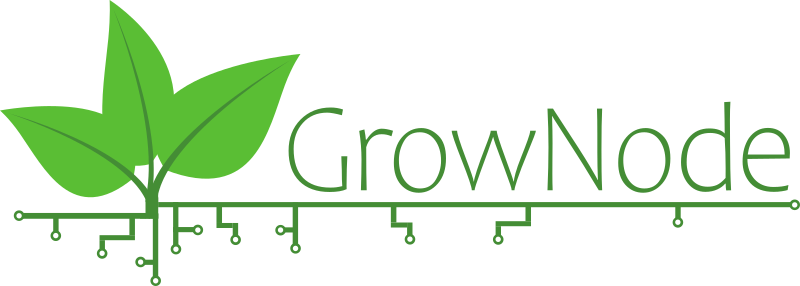
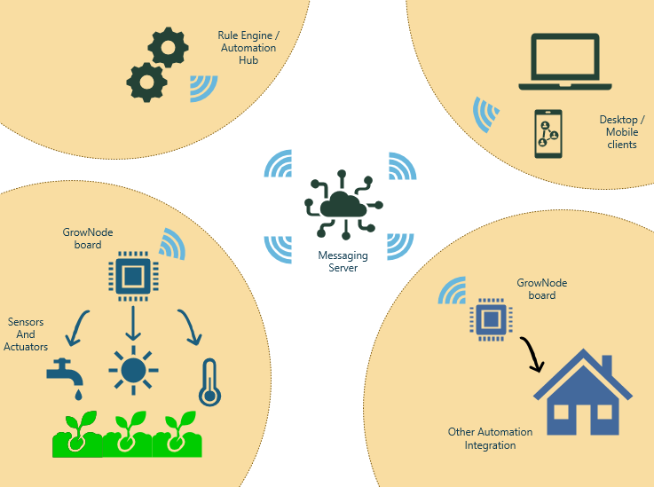

# Get Started

GrowNode is a vertical framework to build IoT devices targeted to growing plants in a controlled environment. It is currently based on the work of [Nicola Muratori](https://github.com/ogghst). 

## Abstract

It all started merging the need to keep updated the software development skills, the curiosity for the IOT world, and the idea that technology could help in restoring the connection between urban people, nature and food.

## First Steps, First Fails

First steps in automating my plants growth were made using circuits using Arduino environment and custom code, wiring sensors and actuators

After first attempts, (almost) working projects, (many) dead plants and (some) successful harvesting, I've immediately found the limits in this methodology:

- Every time I needed to change the behavior of one component or the logic, or add a new sensor, the entire project had to be revised
- The board has the need to interact with user, to inform over the system status (eg. temperature, water level), to ask for help (eg. board offline, no water)
- I needed to integrate the board in my existing home automation, to have an unique place where to check and operate over my plants 
- Once my farming projects increases in number and quality, and my knowledge of this technology advances, I felt the need to add new features and correct bugs in old boards

In short, I needed a library and develop the custom board code on top of it.

I started exploring the existing solution and found the most promising in
- [Espressif Rainmaker](https://rainmaker.espressif.com/) - amazing project from ESP32 vendors to focus on custom application code inheriting a lot of prebuilt features - but too vendor-dependent for me: it requires a cloud connection and it is focused in automating well-defined, industrialized home appliance
- [ESPHome](https://esphome.io/index.html) - quick and easy way to build boards with almost zero code as an Home Assistant add-on - supereasy for very simple projects, but not scalable to develop complex devices and interactions

After nights of web searches I realized the ugly truth - I need to write my own software library!

## Architecture

A typical architecture is composed by

 - one or more grownode boards (called nodes)
 - each board is connected to several sensors (called leaves)
 - a messaging server where each board talks using MQTT
 - an automation server - like openhab, home assistant - that orchestrate the node operations
 - several clients to display and manage nodes
 - other systems, like home automation, gardening, that works together with grownode

### Technologies

GrowNode aims to use most common development tools. Actual release is composed by:

### Hardware

 - ESP32 and above microcontrollers
 - Various displays tested (ILI9341) with touch screen (tested XPT2046) capabilities
 - Common sensors and actuators (relay, PWM output, temperature probes, capacitance sensors..) with any esp-idf compatible libraries

### Software Components

 - ESP-IDF (release 4.4) programming environment
 - MQTT as a messaging system
 - LVGL as display library

### Others (optional)

 - OpenHab/Home Assistant as a controller
 - Fusion360 as Schematic and 3D CAD

### Functionalities

Grownode provides functionalities that lets you kickstart your projects in minutes:

- SoftAP/Bluetooth Provisioning to join and change your wireless network without any hardcode configuration through a mobile app
- High level device configuration through makefile 
- Firmware update Over The Air
- NTP clock sync
- Persistent storage of parameters
- Sensor and Actuators configuration abstracting the hardware level
- Transparent networking protocol (presentation, keepalive, logging)
- Client/Server and Client/Client parameter retrieval and update through MQTT, having in mind highly distributed environment (mesh networks, cloud communication)
  
# Getting Started

## Setup your environment

### IDE

### ESP-IDF

- install ESP-IDF as per [ESP-IDF getting started guide](https://docs.espressif.com/projects/esp-idf/en/latest/esp32/get-started/)

## Build the environment

- install ESP_IDF-LIB as per [ESP-IDF Components library](https://github.com/UncleRus/esp-idf-lib)
- setup main `CMakeLists.txt` file according to your local paths
- `git clone` this repository
- add `lvgl` (release/v8) and `lvgl_esp32_drivers` (master) as components as specified [here](https://github.com/lvgl/lv_port_esp32)
- connect your ESP32 board to a serial port
- open an ESP-IDF prompt to go to project directory
- type `idf.py menuconfig flash build monitor` according to your needs. this will run the latest test code as per the `main.c` file

## 
