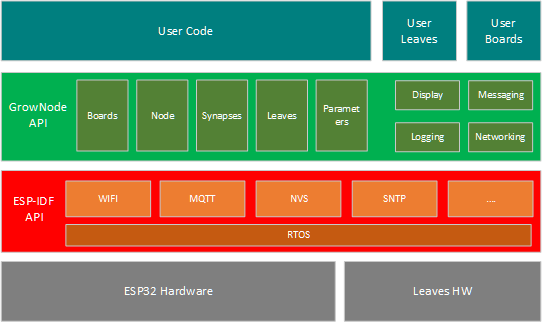

# Reference Guide

This page aims to describe the GrowNode API and how to use it to develop your own firmware. 

> Disclaimer: This is NOT intended for ready-made solution users. Don't tell me I've not warned you! :)

GrowNode is based on the ESP32 microprocessor, and is developed on top of the [ESP-IDF](https://docs.espressif.com/projects/esp-idf/en/latest/esp32/) Development Framework. This allows one to directly access to the ESP32 functionalities and the real-time operating system (RTOS).

In order to mantain a coherent code style and ease the access of all ESP-IDF functionalities, GrowNode is written in pure C, although a C++ version could be done in next future. 

## Basic Concepts

The highest level structure on a GrowNode system is the board itself. Every solution you want to build is basically a combination of:

- Devices attached to the IO pins (typically handled by specific HAL - Hardware Abstraction Layers - like ESP-IDF core libraries or third party devices). *Examples: I2C driver, a GPIO pin*

- Several logics to access to those devices, which are called [Leaves](leaves) in the GrowNode framework - several are prebuilt and more can be user defined. *Examples: a temperature sensor, a relay, a LED, a motor*

- Several [Parameters](parameters) exposed by/to the Leaf, able to retrieve/command specific functionalities. *Examples: the temperature retrieved, a motor switch, a light power*

- One centralized controller that exposes to the Leaves the services needed to work, called [Node](node). This is common on all the GrowNode implementations

- one entry point of the application, where the Node and Leaves are declared and configured, called [Board](boards). *Examples: a Water Tower Board, a simple Temperature and Humidity pot controller*

## Architecture

In ESP-IDF vocabulary, the Board and its corresponding Node works in the main application RTOS task, and each Leaf works in a separate task. This allows the parallel execution of task logic and, moreover, avoids that a leaf in waiting state (eg. waiting for a sensor measure) affects the running of the whole Node. All messaging across leaves is implemented through RTOS events and message queues.

Putting all together, here's an overview of GrowNode platform:

### Code reference

Code Documentation is described in [API](../html/index.html) section. The entry point of all GrowNode functionalities resides in the `grownode.h` header file. Users just have to reference it in their code. 

