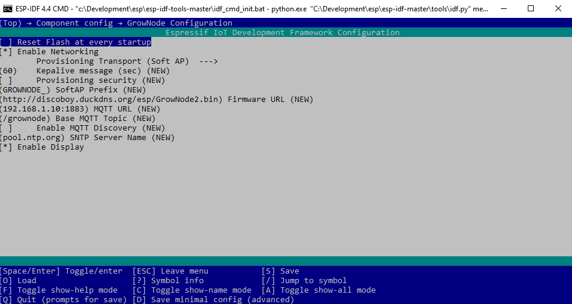

# From Ideas to Project

This page aims to give you the basics on the necessary steps to define and design a GrowNode system. If you are already an advanced user.. You're welcome to add your experience! :)

## Design your application

### Define the scope of your project
 
The first step into your journey in a GrowNode implementation is like every other automated farming project: you need to understand what type of system you want to implement. 
 - **what** do you want to grow? from lettuce to strawberries, to herbs, each situation has his own needs and techniques
 - **where** you want to grow? from a greenhouse to a pot into your kitchen, the environment is important and has effects on the design
 - **how** you want to grow? You want a fully automated system? Or just a light that is turning some hours per day?

Choose among the several possible techniques, and what you want to measure and control. 
Use some tutorials if you are a newbie, like [this one](https://www.youtube.com/watch?v=N7HNAD4EfkQ) from YouTube.

### Sketch your system architecture

Next step is to define the sensor involved in the system you are designing. 
You want to perform automatic watering? Then you need a water pump. You want to measure water temperature? Then you need a temperature probe. Help yourself with a conceptual schema or visit the [solutions](https://github.com/ogghst/GrowNode/tree/master/docs/resources/solutions/hydroboard1) page already made with GrowNode (now it's just my home project :) ) 

## Create your board
You can now start getting your hands dirty!. But not yet in the soil. Your spades and hoes are now called CAD, PCB and solder.
In this step you will transform your idea in working hardware.

### Wiring diagram
First step is to attach all your sensors and actuators to the ESP32. Follow the datasheets, identify the needed hardware, connect to ESP32 GPIOs, put everything together in a schematic, that could be from a piece of paper to an advanced CAD.

Depending on the type of outcome you want, you need to choose carefully your tool.
 - Prototyping - your target is probably a breadboard, therefore you should focus only on material needed, then you will wire up all together on the fly
 - Pre Production - you will probably create a PCB using online shops or directly at home and solder components by yourself
 - Production - you will design everything with a CAD, identify SMT components, and send everything to a PCB manufacturer like JLCPCB

If you are unfamiliar with this process, visit the [solutions](https://github.com/ogghst/GrowNode/tree/master/docs/resources/solutions/hydroboard1) page with some prebuilt ideas.

### Bill of Material
Now you're ready to shop! List your devices you've included in the schematic and wait for the courier. 

## Design your Software
This is a process that can be done together with the hardware part described before. This is usually the most complex part, and **this is where GrowNode will help you**!

### Configure your project
 Follow the instructions on [Install](start.md) page in order to have a working environment on your PC.
 After it, you have a preconfigured environment, that has to be personalized for your needs.

 You have two files to start:

`sdkconfig`,  in the main project directory. This is where all the instructions to the compiler resides. This is a standard place to put your settings that will enable specific functionalities. 
You can edit this file using the IDF command `idf.py menuconfig`in your IDF command shell. browse into `component config`, you will find a section named `grownode`:

Some basic configuration parameters:

 - `reset flash at every startup`: every time the board is started up, all information stored are wiped out. This is useful when you are testing the board and you want to restart every time with a clean situation. please note that this removes also your provisioning status (wifi SSID and password)
 - `enable networking`: in order to have all the network related functionalities. in case of local boards or issues with firmware size this will reduce a lot the firware footprint and enhance performances. Dependant parameters are:
 - `provisioning transport`: how the board will receive wifi credentials at startup. SoftAP means by becoming a local access point, Bluetooth is the other option. Depending on the choice, you will have to use one of the Espressif provisioning apps (at this page)[https://docs.espressif.com/projects/esp-idf/en/latest/esp32/api-reference/provisioning/provisioning.html]
- `keepalive message`: how often the board should publish a status message [see API](html/index.html)
- `provisioning security`: whether provisioning data shall be encrypted and if yes the use of a proof of possession (password) is required
- `SoftAP Prefix`: the name of the temporary network the board will create to ask for wifi credentials
- `firmare URL`: where to search for an updated firmware when the OTA process will start
- `MQTT URL`: where to find the messaging server
- `Base MQTT Topic`: the 'address' of the MQTT messages created by the board and the server
- `Enable MQTT Discovery`: if enabled, once the board is started up it will publish a special message that can be used by controllers like HomeAssistant to autoconfigure baord parameters
- `SNTP Server name`: the address of the time server the board will use to sync his clock
- `Enable Display`: if set, it will start the display driver. the configuration of the display will be taken from `LVGL` component configuration settings 

###Code your application

In the `main` folder of the project you will find a `main.c` file. This is the entry point of the application. Understanding the code requires a knowledge of the C language and it is not the goal of this tutorial. 

Here is a standard `main` application workflow walkthrough:

- Define log configuration directives, done by using the ESP-IDF logging system. Every GrowNode subsystem has his own log tag so it's easy to enable different logging levels depending on what you want to track.

Code:

    esp_log_level_set("*", ESP_LOG_INFO);
    esp_log_level_set("grownode", ESP_LOG_DEBUG);
    esp_log_level_set("gn_commons", ESP_LOG_INFO);
    esp_log_level_set("gn_nvs", ESP_LOG_INFO);
    ...

- Obtain the GrowNode configuration handle. This starts the various subsystems like networking, server messaging, provisioning, display, depending on the configuration you choose in previous steps.

Code:

	gn_config_handle_t config = gn_init();

- Wait for the configuration to be completed, as it takes several seconds depending on the actions needed. In this area you can add your custom code that catches the configuration process status 

Code:

	while (gn_get_config_status(config) != GN_CONFIG_STATUS_COMPLETED) {
		vTaskDelay(1000 / portTICK_PERIOD_MS);
		ESP_LOGI(TAG, "grownode startup sequence code: %d",
				gn_get_config_status(config));
	}
	
- Once the GrowNode configuration process has ended, you can then start defining your project structure. First step is to obtain a Node handler. This can be seen as the 'tree trunk' where the 'leaves' will be attached.

Code:

	gn_node_config_handle_t node = gn_node_create(config, "node");

- And then you can add your sensors and actuators, that in GrowNode languages are called **leaves**. Standard leaves code is contained on `components/grownode/leaves` folder

Code:

	gn_leaf_config_handle_t lights1in = gn_leaf_create(node, "lights1in", gn_relay_config, 4096);

In this example we have created an handle to a relay leaf, called `lights1in`, using the config callback `gn_relay_config`, with a memory space of 4K.
Every leaf has his own characteristic and purposes. Some represents sensors, some actuators, and some has the only purpose to implement control logic for other leaves. The `relay` leaf, for instance, can be reused for multiple actuators in multiple pins. Some others may have limitations due to the specific hardware used.

- In order to make a leaf usable you probably have to configure it. The `relay` leaf need to know what is the GPIO pin attached and the initial status:

Code:

	gn_leaf_param_init_double(lights1in, GN_RELAY_PARAM_GPIO, 25);
	gn_leaf_param_init_bool(lights1in, GN_RELAY_PARAM_STATUS, false);
	
Some paramaters are stored in the board non volatile storage (NVS) for later use (both ones in this case), so the real effect of this initialization is just on the first board initialization. Once the parameters has been stored in the board, it is ignored. 

Please look at the header file of the leaf you want to use to understand the needed parameters.

- At this point the leaf is ready for the startup. This is made by calling:

 Code:

	gn_node_start(node);
	
The framework will  tell the network that the board is online, publish the board sensor data, start all the leaves callbacks , start the listeners for leaves dialogue (in the `relay` leaf, this means the relay can be controlled by setting the `status` parameter). 
	
- Last step, you should implement an infinite loop:

Code:

	while (true) {
		vTaskDelay(10000 / portTICK_PERIOD_MS);
	}

### Prebuilt leaves

You can use the prebuilt leaves under `components/grownode/leaves` folder. Every leaf has his own header file you can use to understand how to use it.

Basic leaves as per today:

#### Actuators

- Relay: turns on/off a GPIO
- Pump: uses the low frequency PWM API to drive a motor
- Pump_HS: uses the LEDC API to drive a PWM device, lice dimming a LED or driving a motor

#### Sensors:

- Capacitive Water Level: gives you the value of a touch sensing device, here used to detect water level
- BME280: gets the data from this temperature/humidity/pressure sensor
- DS18B20: gets the temperature of multiple temperature sensors connected to a GPIO

#### Controllers:

- Pump Control: DEMO leaf to drive a pump depending on temperature
- Watering Control: A more sophisticated controller to drive a water tower hydroponic system, like  [hydroboard1](https://ogghst.github.io/grownode/boards/#hydroboard1)

### Create your own leaves

Goal of GrowNode project is to embrace a wide number of technologies and growing techniques. So I've designed it to be expandable. You can code your own leaf by taking inspiration of the preexisting leaves. Please return to the open source community what the community gave to you, by including your work in this project.

### Wire it up

Start putting your components in a breadbord according to your schematic. Make sure to test all possible hardware and software situation prior to pass to a more elaborated PCB. 

### Share you work!

Repeating myself once again. Once your board is working, please share to the community. Look at the preexisting boards, prepare your material, and let me know how you want to collaborate with GrowNode ecosystem.
